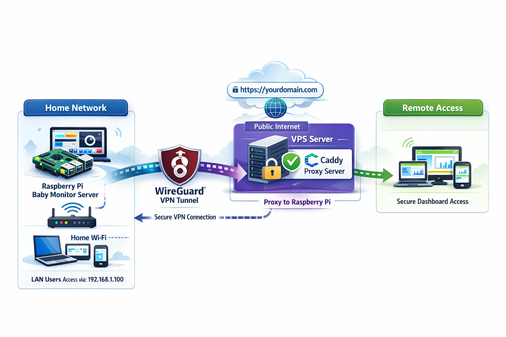
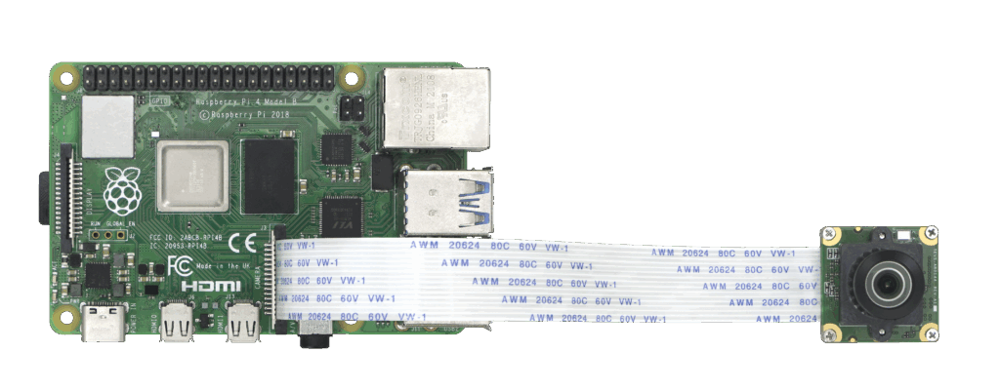
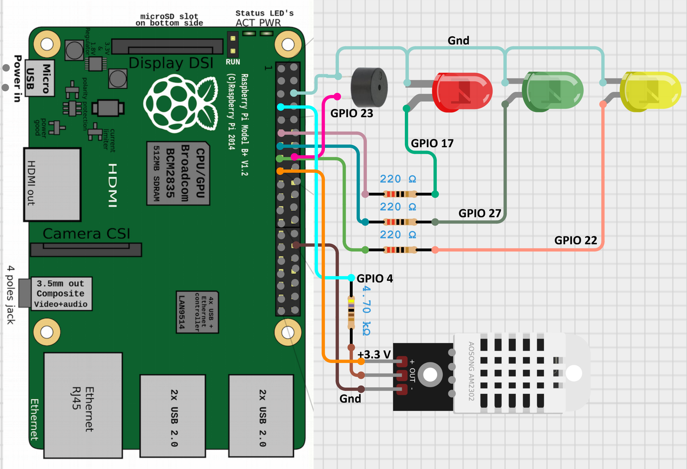

# 🍼 BabyGuard — Smart Raspberry Pi Baby Monitor

<p align="center">
  
</p>

<p align="center">
  
  
  
  
  
</p>

---

## 🚀 Overview
**BabyGuard** is a Raspberry Pi–powered smart baby monitoring system built using **FastAPI + WebRTC** for ultra-low latency streaming.

✔ Works over **LAN + WAN**  
✔ Designed for **real-time monitoring + interaction**  
✔ Lightweight, self-hosted, privacy-first  

---

## ✨ Features

### 🎥 Monitoring
- Live camera feed *(Pi Camera optional)*
- Live microphone streaming *(optional)*
- WebRTC ultra-low latency

### 🌡️ Environment
- Temperature & humidity monitoring
- Outside weather integration

### 🎙️ Interaction
- Push-to-Talk (remote audio to baby room)
- Media player (lullabies / MP3)
- White Noise for Sleep

### 💡 Hardware
- LED Indicator (via GPIO)
- Temp/Humid Sensor (via GPIO)
- Buzzer indicator (via GPIO)

### 📊 System Monitoring
- CPU, RAM, disk, network stats
- Full Raspberry Pi health dashboard

### 🎞️ Media
- Video recording
- Playback interface
- Snapshot capture + gallery

### 🔐 Security
- JWT Authentication

---

## 📸 Screenshots

<p align="center">
  <b>Main Interaction Dashboard</b><br /><br />
  
</p>
<p align="center">
  <b>Mediaplayer & Snapshots Gallery</b><br /><br />
  
  
</p>
<p align="center">
  <b>Resource Usage Tracking</b><br /><br />
  
</p>

---

## 🧠 Architecture (WAN Setup)

<p align="center">
  <b>Wireguard Secure VPN & Caddy Reverse Proxy Config</b><br /><br />
  
</p>

### 🔗 Flow
1. Client connects via domain → Caddy (TLS termination)
2. Caddy reverse proxies to backend
3. WireGuard tunnel connects VPS → Home network (Private Secure VPN)
4. Raspberry Pi (behind NAT) streams via WebRTC

---

## 🔌 GPIO & Hardware Guidelines

<p align="center">
  <b>CSI Camera Module</b><br><br>
  
</p>

<p align="center">
  <b>GPIO Pinout Details</b><br><br>
  
</p>

<p align="center">
  <b>Components Schematic Diagram</b><br><br>
  
</p>

- LED Indicator wiring (GPIO pins)
- Sensor integration (Temp/Humidity) (GPIO pins)
- Buzzer integration (GPIO pins)
- Speakers integration (3.5mm Audio Jack)
- Microphone integration (USB port 2.0 or 3.0)
- Camera module (CSI camera port)

---

## 🔮 Roadmap
- Cry detection (AI)
- Occupancy detection (Vision or Motion Sensor)
- Push notifications
- Facial emotions detection e.g. not feeling comfortable
- Baby heavy movement e.g. moving outside crib
- Converting FE side to React/Angular
---

## 🛠️ Automatic Installation (Recommended)

### 1. Clone
```bash
git clone https://github.com/Zedstron/babymonitor
cd babymonitor
```

### 2. Run Setup
```bash
sudo chmod +x setup.sh
sudo ./setup.sh
```
---

Or if automatic installation isn't working for you, or crashes or packages broken or any thing
in general go wrong try following Manual steps.

## 🛠️ Manuall Installation

### 1. Clone
```bash
git clone https://github.com/Zedstron/babymonitor
cd babymonitor
```

### 2. Update & Upgrade APT repo
```bash
apt update -y
apt upgrade -y
```

### 3. Virtual Env
```bash
python3 -m venv venv
source venv/bin/activate
```

### 4. Install Packages
Install Python Packages
```bash
pip install -r requirements.txt
```

Install System Deps:
```bash
sudo apt update
sudo apt upgrade -y
sudo apt install -y $(cat packages.txt)
```

### 5. SSL
Generate certificates for https, since for PTT to work we cannot access microphone in browser from http, permission won't be allowed
```bash
mkdir cert
cd cert
openssl req -x509 -newkey rsa:2048 -keyout key.pem -out cert.pem -days 365 -nodes
```
---

## ▶️ Run
```bash
python main.py
```

---

## 🤝 Contributing
PRs Welcom